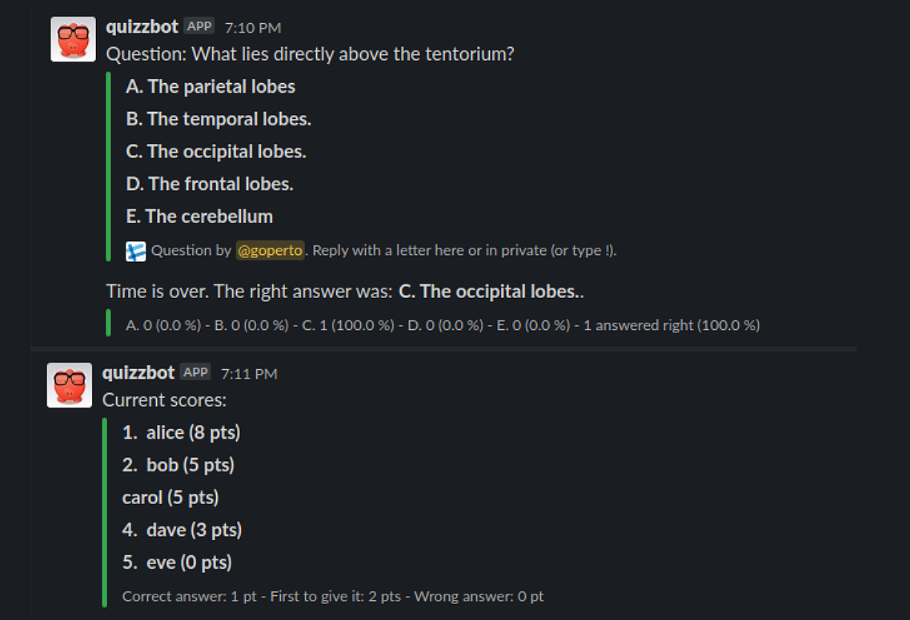

# slack-trivia

`slack-trivia` is yet another integration for Slack workspaces to allow a Slack
bot to run quizzes in your Slack channel. This runs as a Python script calling
the Slack Python API.

## Requirements

- Slack bot - instructions on how to create one at https://api.slack.com/bot-users
- Python v3.7+

## Getting started

1. Create an environment variable `TOKEN` with the bot token.
2. Edit `quizz.py` and define `su` as a list of user IDs who will be allowed to
operate the bot commands.

Then, once the repository cloned in a local folder, run:

`python quizz.py`

